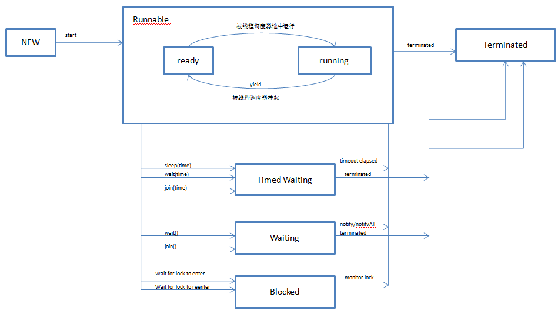

# Java多线程编程核心技术

## java多线程技能
java中实现多线程的两种方式：  
1.继承Thread
2.实现Runnable接口

isAlive()方法，用于测试线程是否处于活动状态，活动状态指的是线程以及启动但是还没有终止的状态。

停止线程的方法：  
1.使用退出标志，使线程正常退出，也就是run方法完成后线程终止。    
2.使用stop方法强制终止线程，不推荐使用，stop/suspend/resume的方法都是过时的方法。  
3.使用interrupt方法中断线程。  

interrupt/interrupted/isInterrupted的区别   
```
interrupt：中断线程
interrupted:是静态方法，用于判断当前线程是否被中断，并且会清除中断标志位
isInterrupted:实例方法，用于判断线程是否中断，不会清除标志位
```

一般线程是不可终止的，使用中断来编写可终止的线程：  
```
//1
public MyThread extends Thread{
	public void run(){
		try{
			for(;;){
				if(this.interrupted){
					throw new InterruptedException();
				}
			}
			//这句话不会执行
			System.out.println("xxxx");
			
		}
		catch(InterruptedException e){


		}
	
	}
}
//2
public MyThread extends Thread{
	public void run(){
		for(;;){
			if(this.interrupted){
	            break;
			}
		}
		//这句话会执行
		System.out.println("xxxx");
	}
}
```

线程处于sleep状态时，被interrupt，此时线程中可以捕获到中断异常，并且中断的标志位会被清除。

suspend用于暂停线程，resume用于重启线程，不推荐使用，因为可能发生死锁。  
```
//方法
public class A{
	public synchronized void doSth{
		//doSthing

		Thread.currentThread().suspend();

		//doSthing
	}
}

//线程A中先调用doSth方法
//线程B中调用doSth方法，这样线程B永远被阻塞了
```

yield方法是放弃当前cpu的时间，但是放弃的时间确定，有可能刚放弃，又获得cpu的执行时间。

线程优先级具有继承性。

守护线程和用户线程，守护线程用于服务其他线程，当所有用户线程运行结束后，守护线程会自动结束。java中的垃圾回收线程就是典型的守护线程。

## 对象及变量的并发访问
synchronized取得的锁都是对象锁，synchronized拥有重入锁的功能。

当一个线程执行的代码出现异常时，其所持有的锁将会自动释放。

以下几种场景是使用的同一个锁对象：  
```
Object obj = new Object();
1.synchronized(obj)
2.obj中的synchronized方法
3.obj中的synchronized(this)方法
```

static方法前面加上synchronized，此时持有的是类的Class对象的锁。

尽量不要使用String对象作为锁对象，因为String使用了常量池，有可能造成死锁。

```
String aStr = "A";
String bStr = "A";

aStr == bStr //true

String aStr1 = new String("A");
String bStr1 = new String("A");

aStr1 == bStr1 //false

public void method(String str){
	synchronized(str){

	}
}

//线程A中调用
method("AA")

//线程B中调用，线程B和线程A持有的是同一个锁，如果线程A长时间执行，那么线程B将会被阻塞
method("AA")
```

线程之间是否同步的核心是看线程是否持有相同的锁对象。

volatile关键字解决了变量在多个线程之间的可见性，synchronized关键字解决了多个线程之间访问资源的同步性(同时确保了可见性和原子性)。

synchronized不仅可以解决一个线程看到的对象处于不一致的状态，还可以保证进入同步方法或者同步代码块的每个线程，都可以看到由同一个锁保护之前所有的修改效果。以下例子说明问题：  
```
////1.运行方式1
public static class Service{
	private boolean b = true;
	
	public void runMethod(){
		
		while(b){
			
		}
		System.out.println("停止。。。。");//这句话在线程1中不会被执行到
	}
	
	public void stopMethod(){
		this.b = false;
	}
}

//mian函数中运行
Service service = new Service();
		
Runnable r1 = new Runnable(){

	@Override
	public void run() {
		service.runMethod();
	}
	
};


Runnable r2 = new Runnable(){

	@Override
	public void run() {
		service.stopMethod();
	}
	
};

Thread t1 = new Thread(r1);
Thread t2 = new Thread(r2);

t1.start();
Thread.sleep(1000);
t2.start();

//2.运行方式2
public static class Service{
	private boolean b = true;
	
	public void runMethod(){
		String a = new String();
		while(b){
			synchronized(a){}
		}
		System.out.println("停止。。。。");//这句话在线程1中会被执行到
	}
	
	public void stopMethod(){
		this.b = false;
	}
}

//mian函数中运行
Service service = new Service();
		
Runnable r1 = new Runnable(){

	@Override
	public void run() {
		service.runMethod();
	}
	
};


Runnable r2 = new Runnable(){

	@Override
	public void run() {
		service.stopMethod();
	}
	
};

Thread t1 = new Thread(r1);
Thread t2 = new Thread(r2);

t1.start();
Thread.sleep(1000);
t2.start();
```

原子类，只能保证原子类中的API是原子操作。

## 线程间通信
等待/通知机制：  
wait()方法，将当前线程置入"预执行队列"中，并且在wait所在代码行处停止执行，直到接到通知或者被中断为止。在调用wait时，线程必须获得该对象的锁，执行wait方法后，当前线程释放锁，在从wait方法返回前，线程与其他线程竞争重新获取锁。  
notify()方法在调用前，也需要获取对象的锁，用于通知正在等待该对象锁释放的其他线程，该方法会随机通知一个等待的线程，执行notify方法后，并不会立马释放锁，等待该线程的代码执行完后才会释放锁。

线程的状态：    
1. Running:运行状态
2. Runnable:可运行状态
3. Blocked：阻塞状态

每个锁对象都有两个队列，一个是就绪队列，用于放置将要获取锁的线程；一个是阻塞队列，用于放置被阻塞的线程。

线程的sleep方法并不会释放锁。

线程通过管道流进行通信：补充详细信息？？？  
字节流：PipedInputStream/PipedOutputStream  
字符流：PipedReader/PipedWriter  

join方法：
当前线程等待子线程的销毁，当线程执行完毕终结时，会自动调用notifyAll方法。  
join(int millis)，等待确定的时间。
join方法内部使用wait来实现等待，当从join方法唤醒时需要重新竞争获取锁对象。
如果在join的过程中，该线程被中断，则会进入中断异常分支。  
join和sleep方法的区别是，join获取锁后会释放锁，sleep不会释放锁。  

ThreadLocal用于保存线程私有的变量，用法：  
```
//定义公共变量，实际使用中将T替换为具体的类
public static ThreadLocal<T> LOCAL = new ThreadLocal<T>();

//在线程1中
T t = LOCAL.get();
LOCAL.set(xxx);

//在线程2中
T t = LOCAL.get();
LOCAL.set(xxx);

//给每个线程调用get时赋默认值，可以继承ThreadLocal类，覆写initialValue方法
public class CustomThreadLocal extends ThreadLocal<T>{
	protected T initialValue(){
		return xxx;
	}
}
```

InheritableThreadLocal子线程可以继承父线程的值。

## Lock的使用
Lock(ReentrantLock)类可以实现更加灵活的同步，功能类似于synchronized关键字。  
通过Lock对象可以创建多个Condition对象，Condition对象的await()/signal()/singalAll()方法等价于Object中的wait()/notify()/notifyAll()方法。  

公平锁/非公平锁，在创建锁对象时传入boolean变量，表示是否使用公平锁。如果是公平锁按照FIFO的方式来分配锁，否则随机分配锁。

Lock Api说明：  
```
int getHoldCount():查询当前线程保持此锁的个数
int getQueueLength():返回正等待获取此锁的线程估计数
int getWaitQueueLength(Condition condition):返回等待condition条件的线程数
boolean hasQueuedThread(Thread thread):指定的线程是否在等待获取锁
boolean hasQueuedThreads():是否有线程正在等待获取锁
boolean hasWaiters(Condition condition)：是否有线程在等待获取condition条件
boolean isFair()：是否是公平锁
boolean isHeldByCurrentThread():当前线程是否持有锁
boolean isLocked():锁对象是否被线程获取
void lockInterruptibly()
boolean tryLock()
```

Condition Api说明：  
```
void awaitUninterruptibly()
void awaitUntil(Date deadline)
```

ReentrantReadWriteLock，拥有一个读锁、一个写锁，读与读不互斥，读与写互斥，写与写互斥。

## 定时器Timer
Timer类的主要作用是设置计划任务。  
TimerTask类用于封装任务。  
在实例化Timer的对象时，Timer实例中会启动一个新的线程(TimerThread)，所有的任务都在这个线程中执行，Timer的内部有一个队列用于存储所有的任务。  

Timer API:  
```
//下一次任务的执行开始时间是上一次任务开始时间+周期(在没有延时的情况下)
//下一次任务的执行开始时间是上一次任务结束时(在有延时的情况下)
void schedule(TimerTask task, ...) 
void scheduleAtFixedRate(TimerTask task, ...)
void cancle()//将任务队列中的所有任务清空，并且线程被销毁
```

TimerTask API:  
```
void cancle()//将该任务从任务队列中清除
```

## 单例模式与多线程
单例的实现：立即加载模式，在调用方法前实例已经被创建：  
```
private static MyObject myObject = new MyObject();

public static MyObject getInstance(){
	return myObject;
}
```

单例的实现：延迟加载，在调用方法时实例才被创建：  
```
//双重检查模式
private static MyObject myObject;

public static MyObject getInstance(){
	if(myObject == null){
		synchronized(MyObject.class){
			if(myObject == null){
				myObject = new MyObject();
			}
		}
	}
	return myObjcet;
}
```

单例的实现：静态内部类实现单例：  
```
public class MyObject{

	private static class InnerClass{
		private static MyObject myObject = new MyObject();
	}

	public static MyObject getInstance(){
	
		return InnerClass.myObject;

	}

}
```

单例与序列化和反序列化？？？：  
```
public class MyObject implements Serializable{

	private static class InnerClass{
		private static MyObject myObject = new MyObject();
	}

	public static MyObject getInstance(){
	
		return InnerClass.myObject;

	}

	protected Object readResolve throws ObjectStreamException {
		return InnerClass.myObject;
	}

}
```

单例模式：使用静态代码块实现：  
```
public class MyObject{

	private static MyObject myObjcet;

	static{
		myObjcet = new MyObject();
	}

	public static MyObject getInstance(){
	
		return myObjcet;

	}

}
```

单例模式：使用枚举实现单例：  
```
public enum MyObject {
	Instance;
	
	public void doSth(){}	
}
//调用
MyObject.Instance.doSth();
```

## 拾遗增补
线程的状态：  
1. NEW:尚未启动的线程的状态
2. RUNNABLE:正在java虚拟机中执行的线程处于这种状态。
3. BLOCKED:受阻塞并等待某个锁的线程处于这种状态。
4. WAITING:无期限地等待另一线程执行某一操作的线程处于这种状态。
5. TIME_WAITING:有期限地等待另一线程执行某一操作的线程处于这种状态。
6. TERMIINATED:退出的线程处于这种状态。




线程组，方便统一管理线程。  
当线程组中断时，线程组中的线程都被中断。  

SimpleDateFormat是非线程安全的。

线程异常处理：  
```
static void setDefaultUncaughtExceptionHandler(UncaughtExceptionHandler eh)//静态方法 优先级低
void setUncaughtExceptionHandler(UncaughtExceptionHandler eh)//实例方法 优先级高
```