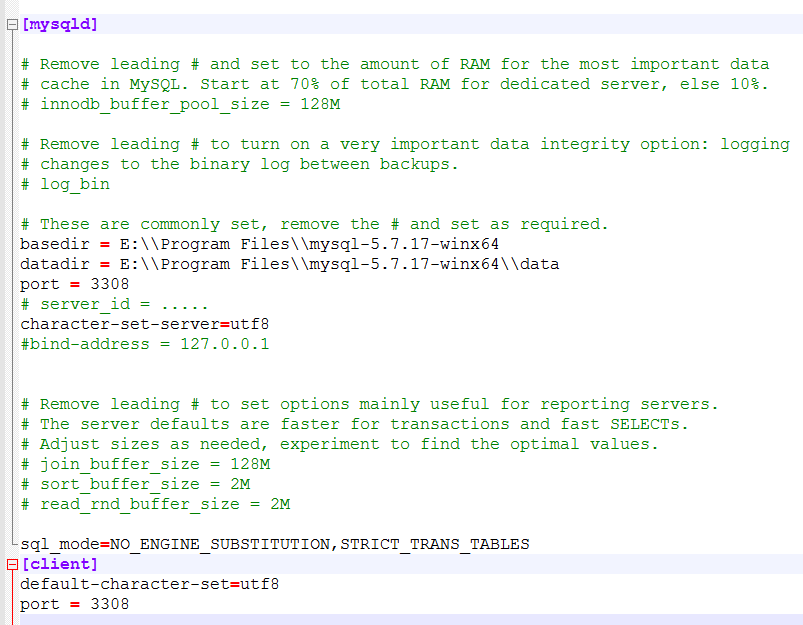

## MySQL知识点

#### 基本概念
* 数据库是保存有组织的数据容器；表是一种结构化数据结构。
* 模式：描述数据库和表的布局及特征的信息。
* 主键：一列或一组列，能够唯一区分表中的每一行。

#### 数据库三范式
范式定义了一个优秀的模式，并且建议大家去遵守，但是并不一定要强制遵守。  

* 范式1：属性不可分割  
要求属性具有原子性，这一点其实需要根据需求来，并不是绝对的。  

* 范式2：表中要有主键，并且其它字段要依赖于主键  
潜在的含义是不相关的东西不要放到一个表中。类似于一个类只做它该做的事情

* 范式3： 一个表中不能包含其它表中的非主键信息，也可以说是不存在传递依赖。  
目的是为了消除冗余数据。

#### MySQL命令
**SHOW命令**  

* 在mysql命令行中输入HELP SHOW可以显示所有的SHOW命令
* 切换数据库：USE mydatabase;
* 显示数据库：SHOW DATABASES;
* 显示数据库中的表：SHOW TABLES;
* 显示表中的列：SHOW COLUMNS FROM tbl_custom;
	> 另一种快捷方式是DESCRIBE tbl_custom

**SELECT命令**  

* 多条SQL语句必须以";"分隔，SQL语句不区分大小写，在处理SQL语句时其中所有空格都被忽略
* SELECT column_name1,column_name2 FROM tbl_custom;
* 通配符"*": SELECT * FROM tbl_custom
* 检索不同的行：SELECT DISTINCT column_name1,column_name2 FROM tbl_custom;
	> DISTINCT关键字必须放置于列名的前面，并且应用于所有的列
* 限制结果：SELECT column_name1 FROM tbl_custom LIMIT 5;SELECT column_name1 FROM tbl_custom LIMIT 5,5;
	> LIMIT带一个参数表示从第一行开始，这个参数表示要返回的行数；带两个参数的话，第一个参数表示开始的位置，第二个参数表示要检索的行数。注意检索出来的第一行是行0
* 完全限定表名：SELECT tbl_custom.column_name1 FROM tbl_custom;

**排序检索的数据**  
 
* 数据排序：SELECT column_name1 FROM tbl_custom ORDER BY column_name1;
通常ORDER BY中所使用的列将是为显示所选择的列，但是用非检索的列排序也是合法的。  
* 多列排序：SELECT column_name1,column_name2 FROM tbl_custom ORDER BY column_name1,column_name2;
先按column_name1排序，在column_name1相同的数据中按照column_name2排序
* 指定排序方向：SELECT column_name1,column_name2 FROM tbl_custom ORDER BY column_name1 DESC,column_name2;
 先按column_name1降序排序，在column_name1相同的数据中按照column_name2排序
	> DESC只作用于直接位于其前面的列
* ORDER BY和LIMIT组合使用：SELECT column_name1 FROM tbl_custom ORDER BY column_name1 LIMIT 1;
	> LIMIT需要位于ORDER BY之后

**数据过滤**  

* 简单过滤：SELECT column_name1 FROM tbl_custom WHERE column_name1=target;
	> 在同时使用WHERE和ORDER BY的时候，ORDER BY要位于WHERE之后  
	> WHERE column_name1=10(column_name1为数值)；  
	> WHERE column_name1='target'(column_name1为字符串)  
* 限定范围：SELECT column_price FROM tbl_custom WHERE column_price BETWEEN 5 AND 10;
	> BETWEEN匹配范围中的所有值，包括指定的开始值和结束值
* 空值检查：SELECT cloumn_name1 FROM tbl_custom WHERE column_name1 IS NULL;
	> NULL空值表示这一列不包含值
* 使用AND来表示多个过滤条件：SELECT column_name1,column_name2 FROM tbl_custom WHERE column_name1=10 AND column_name2<20;
* 使用OR来表示满足任意一个过滤条件：SELECT column_name1,column_name2 FROM tbl_custom WHERE column_name1=10 OR column_name2<20;
* AND和OR组合使用：SELECT column_name1,column_name2 FROM tbl_custom WHERE (column_name1=5 OR column_name1=6) AND column_name2=20
	> 建议同时使用AND和OR时，用括号标识出计算的优先级
* IN操作符：SELECT column_name1 FROM tbl_custom WHERE column_name1 IN ('a','b','c') ORDER BY column_name1;
* NOT操作符，否定它之后所跟的任何条件
	> SELECT column_name1 FROM tbl_custom WHERE column_name1 NOT IN ('A','B','C');

**用通配符进行过滤**  

* %号通配符，%表示任何字符出现任意次数
* _通配符，_匹配单个字符，不能多也不能少：SELECT column_name1 FROM tbl_custom WHERE column_name1 LIKE '_ SS XX';
	> 注意：统配符的搜索效率低，耗时长，不要过度使用统配符；当通配符位于搜索模式的开始处时，搜索起来是最慢的。

**使用正则表达式进行搜索**  

* REGEXP: SELECT column_name1 FROM tbl_custom WHERE column_name1 REGEXP '1000';匹配column_name1中包含文本1000的所有行。
	> 如果想区分大小写，可以使用BINARY关键字：SELECT column_name1 FROM tbl_custom WHERE column_name1 REGEXP BINARY 'aBC';
* 使用OR条件：SELECT column_name1 FROM tbl_custom WHERE column_name1 REGEXP '1000|2000';
* 匹配几个字符之一：[123];匹配除某些字符之外的字符[^123]
	> REGEXP和LIKE的区别是：LIKE匹配整个串，REGEXP匹配子串

**计算字段**

* 字段拼接：Concat,把多个串拼接为一个长串。
	> SELECT Concat(column_name1,'(',column_name2,')') FROM tbl_custom;  
	> 输入示例：column_name1(column_name2)
* 去掉空格，RTrim()/LTrim()/Trim()
* 别名，使用AS来指定别名
	> SELECT Concat(column_name1,'(',column_name2,')') AS column1_cloumn2 FROM tbl_custom;
* 算术计算
	> MySQL支持+，-，*，/的计算  
	> SELECT quantity,price,quantiry*price AS total_price FROM tbl_custom

**数据处理函数**  
* 文本处理函数
	> Left()/Length()/Locate()/Lower()/LTrim()/Right()/RTrim()/Sundex()/SubString()/Upper()
* 日期和时间处理函数
	> AddDate()/AddTime()/CurDate()/CurTime()/Date()/Day()/Hour()/Minute()/Month()/Now()/Second()/Time()/Year()...
* 数值处理函数
	> Abs()/Cos()/Exp()/Mod()/Pi()/Rand()/Sin()/Sqrt()/Tan()

**汇总数据**  

* 聚集函数
	> AVG()/COUNT()/MAX()/MIN()/SUM()
* AVG():返回符合条件的行中某列的平均值
	> SELECT AVG(column_name1) AS avg_column FROM tbl_custom WHERE colum_name2 = 'a';
* COUNT():返回符合条件的行的总数;COUNT(*)对表中的行的数目进行统计，不管表列中的值是否为空(NULL)还是非空，COUNT(column_name)对特定的列中具有值得行进行行数统计，不包括该列值为空(NULL)的行
	> SELECT COUNT(*) AS count FROM tbl_custom WHERE coumn_name2 = 'a';  
	> SELECT COUNT(column_name1) AS count FROM tbl_custom WHERE coumn_name2 = 'a';
* MAX()/MIN():统计某列的最大/小值，不包含NULL值，即可以应用在数值列上也可用于非数值列上。
* SUM():统计某列的总和，不包含NULL值，也可以用于统计计算总和
	> SELECT SUM(privice * quantity) AS total_price FROM tbl_custom;
* 聚集不同值的列，可以使用DISTINCT来限定列名。

**分组数据** 

* GROUP BY  
select字句中的列名必须是分组列或者列函数。  
	> GROUP BY语句必须出现在WHERE子句之后，ORDER BY之前  
	> SELECT column_name1, COUNT(*) FROM tbl_custom WHERE column_name2 = 'a' ORDER BY column_name1;  
	> 使用WITH ROLLUP,可以获取组的信息和所有组的汇总信息：SELECT column_name1, COUNT(*) as num WHERE column_name2 = 'a' ORDER BY column_name1 WITH ROLLUP  
* 过滤分组：HAVING
	> WHERE是过滤行，HAVING是过滤组  
	> SELECT deviceType, COUNT(*) AS num FROM node GROUP BY deviceType HAVING num > 2;
* SQL语句中关键字的顺序  
```
SELECT
FROM
WHERE
GROUP BY
HAVING
ORDER BY
LIMIT
```

**使用子查询**  

* 查询中嵌套查询
* 子查询进行过滤
	> SELECT custom_column1 FROM custom_tbl1 WHERE custom_column2 IN (SELECT column2 FROM custom_tbl2)
* 作为计算字段使用子查询
	> SELECT custom_column1, (SELECT COUNT(\*) FROM custom_tb2 WHERE custom_tb2.id = custom_tbl1.custom_id) FROM custom_tbl1

**联结表**
  
* 外键：为某表中的一列，它包含了另一表的主键值，定义了两个表之间的关系。
	> SELECT vend_name,prod_name FROM vender,product WHERE vender.vend_id = product.vend_id
* 内部联结：等值联结，基于两个表之间的相等测试，也称为内部联结。
	> SELECT vend_name,pord_name FROM vender INNER JOIN product ON vender.id=product.vend_id

**创建高级联结**
  
* 自联结
	> SELECT p1.prod_id,p1.prod_name FROM products AS p1, products AS p2 WHERE p1.vend_id = p2.vend_id AND p2.prod_id = 'DENTR'
* 内联结，返回两个表中联结字段相等的行  
    > SELECT * FROM A Inner JOIN B ON A.id=B.id
* 外联结：内联结是查询出所有关联的行，外联结中还查询出来没有关联的行。
	> RIGHT OUTER JOIN: 包含右表的所有行  
	> LEFT OUTER JOIN: 包含左表的所有行  
	> SELECT customer.cust_id,orders.order_num FROM customers RIGHT OUTER JOIN orders ON orders.cust_id = customers.cust_id

**创建组合查询**

* 组合查询：执行多个查询，并且将查询结果作为单个查询结果集返回。
* 使用UNION的条件：
	* 必须有两条或以上的select语句
	* 每个查询必须包含相同的列
	* 列数据的类型必须兼容
* 使用UNION会默认消除重复的行；UNION ALL会包含重复的行。
* 组合查询中只能使用一次ORDER BY，并且ORDER BY只能出现在最后一个select语句中，ORDER BY会对所有的查询结果进行排序。

**全文本搜索**

* MyISAM支持全文本搜索，而InnoDB不支持
* 使用LINKE，正则表达式搜索的缺陷是：
	* 性能，因为需要匹配所有行
	* 很难明确控制匹配项
	* 搜索出来的结果排序不够智能化
* MySQL会创建指定列中各个词的索引，这样使用全文本搜索时，性能更好
* 启动全文本搜索支持
	> CREATE TABLE productnotes(
	> note_id int NOT NULL AUTO_INCREMENT,
	> prod_id char(10) NOT NULL,
	> note_date datetime NOT NULL,
	> note_text text NULL,
	> PRIMARY KEY(note_id),
	> **FULLTEXT(note_text)**
	> )ENGINE=MyISAM;
	> FULLTEXT(note_text)会对note_text进行索引
* 进行全文本搜索
	> SELECT note_text FROM productnotes WHERE Match(note_text) Against('rabbit');
	> Match()指定需要被搜索的列；Against()指定要使用的搜索的列
* 使用查询扩展，作用是放宽搜索结果范围，原理
	* 首先进行全文本搜索，找到所有匹配行
	* 其次，MySQL检查这些匹配的行并选择所有有用的词(怎么判读有用的词？？？)
	* 再其次，MySQL会再次进行全文本搜索，这次不仅使用原来的条件，而且还使用所有有用的词
	> SELECT note_text FROM productnotes WHERE Math(note_text) Against('heavy' WITH QUERY EXPANSION );
* 布尔文本搜索，可以提供如下功能
	* 要匹配的词
	* 要排斥的词
	* 排列提示（哪些词等级更高）
	* 表达式分组
	* 另外一些内容
	> SELECT note_text FROM productnotes WHERE Math(note_text) Against('heavy' IN BOOLEAN MODE);
* 文本搜索的使用说明
	* 短词被忽略且从索引中排除，短词定义为哪些具有3个及少于3个字符的词
	* MySQL带有一个内建的非用词列表，这些词在索引全文本数据时总是被忽略
	* MySQL规定了一条50%的规则，如果一个词出现在50%以上的行中，那么这个词会被作为一个非用词
	* 如果表中的行数少于3行，则全文搜索不返回结果
	* 忽略词中的单引号，don't索引为dont
	
**插入数据**

* 插入单行数据  
对于自增长的主键可以省略,对于可以为NULL或者给定了默认值的列也是可以省略的
	> INSERT INTO custom_tbl(column_1,column_2,column_3,column_4) VALUES(1,2,3,4)
* 插入多行数据
	 * 使用多条INSERT语句，每条INSERT语句插入一行数据
	 * 如果插入的列一样，可以使用如下方式：INSERT INTO custom_tbl(column_1,column_2,column_3,column_4) VALUES(1,2,3,4),VALUES(5,6,7,8)
* 插入检索出的数据  
从一个表中检索出数据插入到另一张表中
	> INSERT INTO custom_tbl(column_1,column_2,column_3,column_4) SELECT(column_5,column_6,column_7,column_8) FROM custom_tbl1;

**更新和删除数据**

* 更新
更新单行  
	> UPDATE customers SET column1 = 'a', column2 = 'b' WHERE id = 10;
更新所有行  
	> UPDATE customers SET column1 = 'a', column2 = 'b';
* 删除
删除一行  
	> DELETE FROM customers WHERE id = 10;
删除所有行  
	> DELETE FROM customers;  
DELETE删除的是表的内容，而不是表本身。如果想从表中删除所有的行，使用TRUNCATE TABLE，它完成相同的工作，但是速度更快，TRUNCATE实际上是删除原来的表，并重新创建一个表。
如果想删除表使用DROP TABLE

**创建和操纵表**

* 表的创建  
```
CREATE TABLE customers 
(
 cust_id int NOT NULL AUTO_INCREMENT,
 cust_name char(50) NOT NULL,
 PRIMARY KEY(cust_id)
)ENGINE=InnoDB;
```

NULL值表示没有值或者缺值，表示插入数据时，可以不用给该列指定值。  
* 主键  
主键值必须唯一，表中的每个行必须具有唯一的主键值，主键可以是单列，也可以是多列的组合。  
```
CREATE TABLE orderitems
(
 order_num int NOT NULL,
 order_item int NOT NULL,
 prod_id char(10) NOT NULL,
 PRIMARY KEY(order_num,order_item)
)
```

主键可以在创建表的时候定义，也可以在创建表之后定义。  
主键列不能为NULL  
* AUTO_INCREMENT
每个表只允许一个AUTO_INCREMENT列，并且它必须被索引(例如成为主键)  
使用SELECT last_insert_id()可以获取最后一次AUTO_INCREMENT的值  
* 设置默认值  
```
CREATE TABLE orderitems
(
 order_num int NOT NULL,
 order_item int NOT NULL,
 prod_id char(10) NOT NULL DEFAULT '',
 PRIMARY KEY(order_num,order_item)
)
```

* 引擎对比
	* InnoDB,支持事务处理引擎，不支持全文本搜索
	* MEMORY数据存储在内存，速度很快
	* MyISAM性能极高，支持全文本搜索，但是不支持事务处理
引擎是可以混用的  
* 更新表  
使用ALTER TABLE来更改表的结构。  
添加列：ALTER TABLE vendors ADD vend_phone CHAR(20);  
删除列：ALTER TABLE vendors DROP COLUMN vend_phone;  

定义外键：  
ALTER TABLE orderitems 
ADD CONSTRAINT fk_orderitems_orders 
FOREIGN KEY(order_num) REFERENCES orders(order_num);  
* 删除表  
DROP TABLE customers;
* 重命名表  
RENAME TABLE customer TO customers;

**视图**

* 视图可以认为是一张虚拟的表
* 视图的作用
	 * 重用sql语句
	 * 简化sql操作
	 * 使用表的组成部分而不是整个表
	 * 保护数据，可以授予用户表特定部分的访问权限
	 * 更改数据格式和表示
* 视图本身不包含数据，返回的数据是从其它表中检索出来的。创建视图后，可以把视图作为普通的表使用
* 视图的操作
	 * 创建：CREATE VIEW
	 * 查看：SHOW CREATE VIEW viewName
	 * 删除：DROP VIEW viewName
	> CREATE VIEW test_test1 AS SELECT name, title FROM test, test1 WHERE test.id = test1.id;  
	> SELECT * FROM test_test1;
* 视图是可以更新的，但是一般使用视图来查询，而不是更新。


#### MySQL的安装
1.从oracle官网上下载Community版本的MySQL Community Server的安装zip包  

2.设置my.ini文件  

  
3.安装MySQL服务  
> 注意：以管理员权限运行cmd  
> 输入mysqld --install MySQL  
> 输入mysqld --remove MySQL可以删除MySQL服务  

4.初始化data数据，下载下来的5.7.17版本的MySQL解压以后没有data文件夹，因此需要初始化data数据
> 输入mysqld  --initialize-insecure
> 在mysql的解压目录中会出现data文件夹

5.启动MySQL服务
> 输入net start MySQL
> 输入net stop MySQL可以停止MySQl服务
> mysqladmin -u root -p password shutdown也可以停止MySQL服务

6.登录
> 输入mysql -u root

7.修改root用户的密码
> `set password for root@localhost = password("admin");`

8.创建用户
> `create user 'platform_admin'@'localhost' identified by 'weieyuan';`

9.赋予权限
> `grant all on *.* to 'platfrom_admin'@'localhost';`  
> 或者
> `grant all privileges on *.x to 'platfrom_admin'@'localhost';`
> `flush privileges`

#### 杂项知识点
* CHAR和VARCHAR  
均可以指定最大长度，CHAR是定长存储的，VARCHAR是变长存储的。  
CHAR长度在1-255，VARCHAR长度在1-65535  
|Value|CHAR(4)|Storage|VARCHAR(4)|Storage|
|----|----|----|----|----|
|''|'    '|4bytes|''|1byte|
|'ab'|'ab  '|4bytes|'ab'|2byte|
|'abcdef'|'abce'|4bytes|'abcd'|bytes|

* SELECT DATABASE()显示当前在使用的数据库名称


