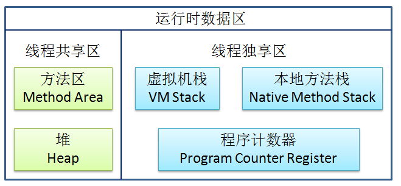

#java虚拟机#
____
#### Java内存区域 ####
* java程序运行时的数据区域

* 程序计数器
> 线程私有内存
> 如果执行的是java方法，那么该计数器记录了正在执行的**虚拟机字节码指令地址**；如果执行的是本地方法，那么计数器的值为空
> 此内存区域是唯一没有规定OutOfMemoryError情况的区域

* 虚拟机栈
> 线程私有
> 每个java方法被执行的时候都会创建一个栈帧(一种数据结构)，用于存储局部变量表、操作数栈、动态链接、方法出口等信息。每个方法的调用，都会对应一个栈帧在虚拟机栈中入栈到出栈的过程。
> 局部变量表在编译期间就会确定所需要占用的栈内存大小
> 这个内存区域可能抛出的异常类型有StackOverflowError、OutOfMemoryError

* 本地方法栈
> 线程私有
> 本地方法栈为虚拟机使用到的本地方法服务，与虚拟机栈的区别是虚拟机栈为java方法服务
> 有的虚拟机例如Sun HotSpot将虚拟机栈和本地方法栈合二为一

* java堆
> 线程共享
> 在虚拟机启动时创建，所有对象的实例以及数组都要在堆上分配
> 是垃圾收集器主要管理的内存区域
> 该区域的大小可以是固定的；也可以是可扩展的，通过-Xmx和-Xms来指定
> 当该区域无法扩展并且无法创建对象实例时，就会抛出OutOfMemoryError的异常

* 方法区
> 线程共享
> 用于存储已经被虚拟机加载的类的信息、常量、静态变量、即时编译器编译后的代码等数据
> 该区域也会存在内存回收，主要是常量池回收和对类型的卸载
> 会抛出OutOfMemoryError的异常

___

* 运行时的常量池
> 属于方法区的一部分
> 用于存放编译期生成的各种字面量和符合引用，这部分内容将在类加载后进入方法区的运行时常量池中存放。
> 运行期间也可能将新的常量放入池中，例如String对象的intern()方法
* 直接内存
> 不是虚拟机运行时的数据区的一部分
> NIO可以使用Native函数库直接分配堆之外的内存，然后通过一个存储在java堆中的DirectByteBuffer对象作为这块内存的引用进行操作
> 直接内存不受java堆大小的限制，但是受到本机总内存的限制，在配置虚拟机参数时应该避免总的内存超过物理内存，避免出现内存溢出
* 对象的创建过程
	* 虚拟机遇到new的指令时，首先去检查这个指令的参数是否能够在常量池中定位到一个类的符号引用，并且检查这个符号引用代表的类是否已经被加载，如果没有，那么必须先执行类的加载
	* 为对象分配内存，对象所占内存的大小在类的加载时就确定了
	* 将分配到到到内存空间都初始化为零值，这一把工作可以提前到TLAB分配时去做
	* 虚拟机对对象做必要的设置，例如这个对象是哪个类的实例、如何才能找到类的元数据信息、对象的哈希码、对象的GC分代年龄等信息，这些信息都存放在对象的对象头中
	* 执行<init>方法，对对象进行初始化
* 对象的内存布局
	* 对象头
		* 第一部分用于存储对象自身运行时的数据，如哈希码、GC分代年龄、锁状态标志、线程持有的锁、偏向线程ID、偏向时间戳，这部分数据的长度在32位和64位(未开启压缩指针)的虚拟机中分别为32bit和64bit
		* 第二部分是类型指针，即对象指向它的类元数据的指针，用于确定这个对象是哪个类的实例；如果这个对象是数组，那么对象头中还需要记录数组的长度
	* 实例数据，也就是程序代码中所定义的各种类型的字段内容
	* 对齐填充，起占位符的作用，确保对象的起始地址是8字节的整数倍
* 对象的访问定位
描述了栈上的引用是如何定位到堆上的具体对象，目前主要有两种方法：
	* 使用句柄，堆中有一块内存作为句柄池，栈上的引用存放的是对象的句柄地址，句柄中包含了对象实例数据和类型数据的具体地址
	* 使用直接指针，栈上的引用存放的就是堆中对象的地址。这也是Sun HotSpot的实现方式
* 各种内存参数
	* 设置堆内存：-Xms20m -Xmx20m
	* 设置栈容量(虚拟机栈和本地方法栈)：-Xss128k

####类文件结构####
* .java--->.class(java虚拟机)--->机器码(操作系统)
* class文件是以8位字节为基础单位的二进制流。class文件中只有两种数据结构，无符号的数和表，无符号数为u1,u2,u4,u8表示1,2,4,8个字节的无符号数；表由多个无符号数或者其他表组成的复杂数据结构，所有表习惯性以"_info"结尾
