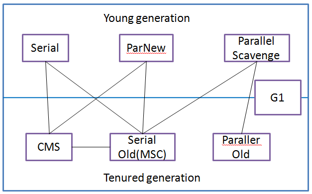
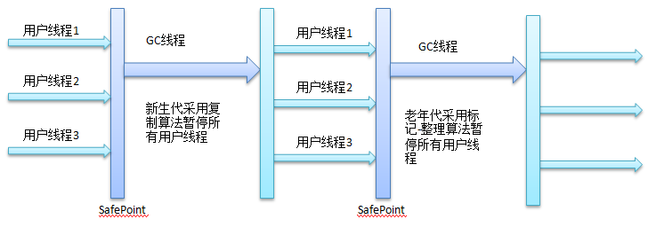
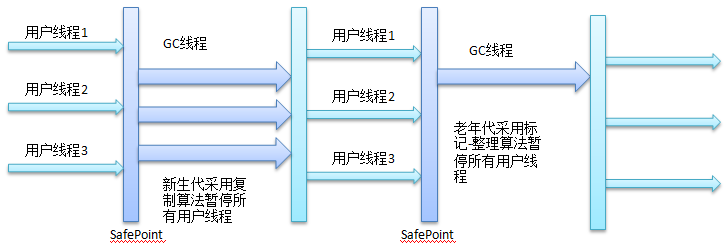
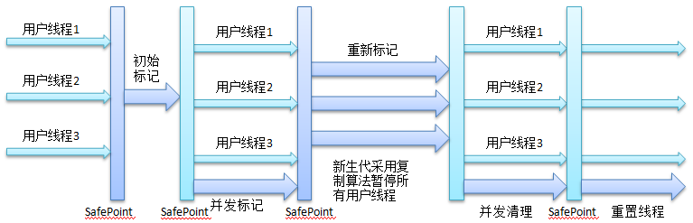
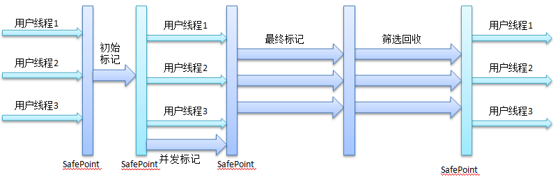
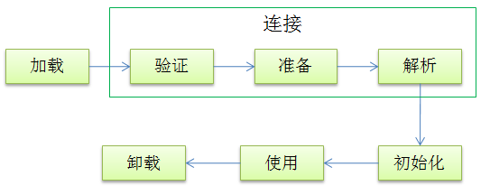

#java虚拟机#
____
#### Java内存区域 ####
* java程序运行时的数据区域

* 程序计数器
> 线程私有内存
> 如果执行的是java方法，那么该计数器记录了正在执行的**虚拟机字节码指令地址**；如果执行的是本地方法，那么计数器的值为空
> 此内存区域是唯一没有规定OutOfMemoryError情况的区域

* 虚拟机栈
> 线程私有
> 每个java方法被执行的时候都会创建一个栈帧(一种数据结构)，用于存储局部变量表、操作数栈、动态链接、方法出口等信息。每个方法的调用，都会对应一个栈帧在虚拟机栈中入栈到出栈的过程。
> 局部变量表在编译期间就会确定所需要占用的栈内存大小
> 这个内存区域可能抛出的异常类型有StackOverflowError、OutOfMemoryError

* 本地方法栈
> 线程私有
> 本地方法栈为虚拟机使用到的本地方法服务，与虚拟机栈的区别是虚拟机栈为java方法服务
> 有的虚拟机例如Sun HotSpot将虚拟机栈和本地方法栈合二为一

* java堆
> 线程共享
> 在虚拟机启动时创建，所有对象的实例以及数组都要在堆上分配
> 是垃圾收集器主要管理的内存区域
> 该区域的大小可以是固定的；也可以是可扩展的，通过-Xmx和-Xms来指定
> 当该区域无法扩展并且无法创建对象实例时，就会抛出OutOfMemoryError的异常

* 方法区
> 线程共享
> 用于存储已经被虚拟机加载的类的信息、常量、静态变量、即时编译器编译后的代码等数据
> 该区域也会存在内存回收，主要是常量池回收和对类型的卸载
> 会抛出OutOfMemoryError的异常

___

* 运行时的常量池
> 属于方法区的一部分
> 用于存放编译期生成的各种字面量和符合引用(符号引用？？？)，这部分内容将在类加载后进入方法区的运行时常量池中存放。
> 运行期间也可能将新的常量放入池中，例如String对象的intern()方法
* 直接内存
> 不是虚拟机运行时的数据区的一部分
> NIO可以使用Native函数库直接分配堆之外的内存，然后通过一个存储在java堆中的DirectByteBuffer对象作为这块内存的引用进行操作
> 直接内存不受java堆大小的限制，但是受到本机总内存的限制，在配置虚拟机参数时应该避免总的内存超过物理内存，避免出现内存溢出
* 对象的创建过程
	* 虚拟机遇到new的指令时，首先去检查这个指令的参数是否能够在常量池中定位到一个类的符号引用，并且检查这个符号引用代表的类是否已经被加载，如果没有，那么必须先执行类的加载
	* 为对象分配内存，对象所占内存的大小在类的加载时就确定了
	* 将分配到到到内存空间都初始化为零值，这一把工作可以提前到TLAB分配时去做
	* 虚拟机对对象做必要的设置，例如这个对象是哪个类的实例、如何才能找到类的元数据信息、对象的哈希码、对象的GC分代年龄等信息，这些信息都存放在对象的对象头中
	* 执行<init>方法，对对象进行初始化
* 对象的内存布局
	* 对象头
		* 第一部分用于存储对象自身运行时的数据，如哈希码、GC分代年龄、锁状态标志、线程持有的锁、偏向线程ID、偏向时间戳，这部分数据的长度在32位和64位(未开启压缩指针)的虚拟机中分别为32bit和64bit
		* 第二部分是类型指针，即对象指向它的类元数据的指针，用于确定这个对象是哪个类的实例；如果这个对象是数组，那么对象头中还需要记录数组的长度
	* 实例数据，也就是程序代码中所定义的各种类型的字段内容
	* 对齐填充，起占位符的作用，确保对象的起始地址是8字节的整数倍
* 对象的访问定位
描述了栈上的引用是如何定位到堆上的具体对象，目前主要有两种方法：
	* 使用句柄，堆中有一块内存作为句柄池，栈上的引用存放的是对象的句柄地址，句柄中包含了对象实例数据和类型数据的具体地址
	* 使用直接指针，栈上的引用存放的就是堆中对象的地址。这也是Sun HotSpot的实现方式
* 各种内存参数
	* 设置堆内存：-Xms20m -Xmx20m
	* 设置栈容量(虚拟机栈和本地方法栈)：-Xss128k
	* 在jdk1.6之前可以设置方法区的大小：-XX:PermSize=10M -XX:MaxPermSize=10M
	* 直接内存容量的设置：-XX:MaxDirectMemorySize=10M

#### 垃圾收集器与内存分配策略 ####
* 判断对象是否已死
	* 引用计数算法，记录对象被引用的次数，缺点是很难解决对象之间相互循环引用的问题
	* 可达性性分析算法，选择一些“GC Roots”的对象作为起点，从这些节点开始向下搜索，搜索所走过的路径称为引用链，当一个对象到“GC Roots”不可达时，说明此对象是不可达的。在java语言中，可以作为“GC Roots”的对象有
		* 虚拟机栈(栈帧中的本地变量表)中引用的对象
		* 方法区中类静态属性引用的对象
		* 方法区中常量引用的对象
		* 本地方法栈中的JNI(本地方法)应用的对象

* 对象的引用，分为4中引用，引用强度从强到弱
	* 强引用，Object obj = new Object(),强引用对象是不会被回收的
	* 软引用，描述有用但是非必须的对象，在系统将要发生内存溢出异常之前，将会把这些对象列进回收范围之中进行第二次回收。JDK1.2之后，提供SoftReference类来实现软引用
	* 弱引用，描述非必需对象，被弱引用关联的对象只能生存到下一次垃圾收集发生之前。当垃圾收集器工作时，无论当前内存是否足够，都会回收掉只被弱引用关联的对象，在JDK1.2之后，提供了WeakReference类来实现弱引用
	* 虚引用，一个对象是否存在虚引用，完全不会对其生存时间构成影响，也无法通过一个虚引用来取得一个对象实例。它的唯一目前就是在这个对象被回收的时候收到一个系统通知。JDK1.2之后，提供了PhantomReference类来实现虚引用

* 对象是否真的"死亡"
一个对象真正死亡，需要经历两次标记过程，对象进行可达性分析后，发现没有和GC Root相连接的引用链，那么它就会被第一次标记并且进行筛选，筛选的条件是是否需要执行对象的finalize()方法，如果对象没有覆写该方法或者对象的该方法已经被虚拟机调用过，虚拟机认为这两种情况是"没有必要执行"。
如果需要执行finalize()方法，这个对象将会被放置到一个叫做F-Queue的队列中，并在一个由虚拟机自动创建，低优先级的Finalizer线程去执行，请注意虚拟机会触发这个方法，但是并不会等待它执行结束。
在finalizer()方法中，如果成功将对象和引用链上的对象相关联起来，那么该对象就可以逃脱被回收的命运。GC会对F-Queue中的对象进行第二次小规模的标记，如果对象逃脱成功，那么它将被移除出"即将回收"的集合。

* 方法区的回收
主要回收废弃的常量和无用的类
	* 废弃的常量，例如字符串常量
	* 无用的类，判断条件如下。满足条件只是说可以回收，并不一定会回收。
		* 该类的所有实例都已经被回收
		* 加载该类的ClassLoader已经被回收
		* 该类的Class对象没有在任何地方被引用

* 垃圾收集算法
	* 标记-清除算法，分为标记和清除两个阶段，首先标记所有需要回收的对象，然后统一回收被标记的对象。缺点：
		* 效率低，标记和清除的效率都不高
		* 空间碎片，清除之后会产生大量的不连续的内存碎片，后续如果在分配内存空间的时候，如果找不要一块连续的满足大小的内存空间，那么就需要提前触发另一次垃圾回收
	* 复制算法，解决标记-清除算法的效率问题，思路是将内存分为两块，只使用其中一块内存用于分配给对象，当这一块内存用完了，就将还存活的对象复制到另一块内存中去，然后对第一块内存统一回收。这种方式的缺点是，损失了内存空间，并且如果频繁地进行内存复制，效率也会降低。目前的商业虚拟机都采用这种方法来回收新生代，因为新生代的98%的对象都是"朝生夕死"。HotSpot将内存分为一块较大的Eden空间和两块较小的Survivor空间，一块Eden空间和一块Survivor的大小是8:1，每次使用Eden和一块Survivor空间，剩余一块Survivor用于内存回收。如果回收的对象超过10%，那么Survivor的空间会不够用，这个时候使用老年代的内存进行担保，存放不下的对象通过分配担保机制进入老年代。
	* 标记-整理算法，标记过程和标记-清除的算法的过程一样，但是后续并不是直接回收标记对象，而是让所有存活的对象都向一端移动，然后直接清理掉边界以外的内存
	* 分代收集，根据对象的存活周期不同选择不同的收集算法，对于新生代，选择复制算法，对于老年代，选择标记-清除算法或者标记-整理算法

* HotSpot算法的实现
	* 枚举根节点，虚拟机在分析对象的引用关系时，为了确保分析结果的正确性，会暂停所有java线程，这个称为"Stop The World"。为了提高搜索的效率，目前主流的虚拟机都采用的准确式GC，当系统停顿下来后并不需要搜索所有的全局变量和执行上下文，虚拟机是可以知道哪些地方是存放了对象的引用的，在HotSpot的实现中是使用一组称为OopMap的数据结构来达到这个目的的，虚拟机会在特定的位置记录下栈和寄存器中哪些位置是引用。
	* 安全点，记录引用关系的地方，称为安全点，程序只有在到达安全点的地方暂停后才能执行GC。GC发生时让线程跑到安全点处，有两种方法，一种是抢先式中断，先中断所有线程，然后让不在安全点上的线程恢复执行跑到安全点处，这种方法几乎已经不被使用，另一种是主动式中断，需要GC的时候，设置一个标志位，各个线程主动去轮询该标志位，轮询点和安全点是重合的，当标志位为真时就将自己中断挂起。
	* 安全区域，可以看作是安全点的扩展，在安全区中对象的引用关系是不会发生变化的，在安全区中的任何地方开始GC都是安全的。当线程进入安全区域时，首先标识自己已经进入安全区域，这样当需要GC时，就不需要管这个线程了，当线程离开安全区域时，需要看看是否正在GC，如果是需要等待GC结束，否则直接往下执行。存在安全区域的原因是：安全点并不能完全保证GC能够顺利进行，比如如果一个线程没有分配CPU时间，典型的例子是线程处于Sleep状态或者Blocked的状态时，是不能响应中断的，因此线程不能走到安全点。

* 垃圾收集器
垃圾收集器是垃圾算法的具体的实现，各种垃圾收集算法：


* Serial收集器(串行收集器)
单线程收集器，并不仅仅是只使用一个CPU或者一个线程去完成垃圾收集工作，更重要的是当它在进行垃圾回收的时候，必须暂停其他所有的工作线程，直到它收集结束。
缺点：需要暂停所有工作线程
优点：简单高效，高效是指收集器没有线程直接的交互，只需要专心做垃圾收集工作
原理示意图：


* ParNew收集器
Serial收集器的多线程版本，使用多线程进行垃圾收集。
目前只有Serial和ParNew收集器可以和CMS收集器配合使用
原理示意图：


* Parallel Scavenge(并行清除)收集器
新生代收集器，使用复制算法，并行的多线程收集器
目标是达到一个可控制的吞吐量，吞吐量是CPU用于运行用户代码的时间与CPU总消耗时间的比值

* Serial Old收集器
Serial收集器的老年代版本
使用标记-整理算法

* Parallel Old收集器
Parellel Scavenge收集器的老年代版本
使用多线程和标志-整理算法

* CMS(Concurrent Mark Sweep)收集器
以获取最短停顿时间为目的的收集器
优点：并发、低停顿
四个阶段：初始标记、并发标记、重新标记、并发清除
*初始标记*，"Stop the world"，仅仅标记下GC Roots能够直接关联到的对象，速度很快
*并发标记*，GC Roots Tracing，和用户线程一起运行
*重新标记*，"Stop the wrold"，修正并发标记期间因用户程序运行导致标记产生变动的那一部分对象的标记
*并发清除*，内存回收，和用户线程一起运行
缺点：
*对CPU资源敏感*，在并发阶段，它会占用一部分线程而导致用户程序变慢，CMS默认启动的线程数是(CPU数量 + 3) / 4。
*CMS无法处理"浮动垃圾"*(浮动垃圾是指在并发清理阶段，用户的线程还在运行，用户线程在运行过程中产生的垃圾只能留在下一次垃圾清理时回收，这部分垃圾称为浮动垃圾)。在CMS运行期间，如果预留的内存不够用户线程的使用，就会出现一次"Concurrent Mode Failure"，这个时候就会启动Serial Old收集器来回收老年代垃圾，同时会导致程序的停顿时间变长。
*CMS是基于标注-清理的垃圾器，会产生内存碎片*
原理示意图：


* G1(Garbage-First)收集器
G1收集器的特点：
*并行和并发*
*分代收集*，采用不同的方式去处理新创建和存活了一段时间的对象
*空间整合*，从整体看采用"标记-整理"算法实现的收集器，从局部看采用"标记-复制"算法实现的收集器
*可预测的停顿*，这个是相对于CMS的另一大优势，可以让使用者明确指定在一个长度为M毫秒的时间片段内，消耗在垃圾收集上的时间不得超过N毫秒
G1收集器将java的堆空间划分为很多大小相等的region，垃圾回收的时候只在部分region上回收垃圾，这样避免了在整个java堆上进行垃圾回收。G1收集器跟踪各个region力垃圾堆积的价值大小(可回收的空间大小以及回收所需的时间经验值)，在后台维护一个优先级的列表，根据允许的回收时间大小，优先回收价值最大的region(这也是G1命名的由来)
为了解决region之间对象引用的问题，G1中的每一个region有一个Remembered Set，用于记录其他region对该region中对象的引用关系，这样避免了在垃圾回收的时候对堆的全局扫描获取引用关系。
G1收集器的运作过程：
*初始标记*，标记和GC Root直接关联的对象
*并发标记*，从GC Root开始对堆中的对象进行可达性分析
*最终标记*，修正在并发标记阶段因用户程序继续运行导致引用关系发生变化的对象，将这一部分信息记录到Remembered Set Logs中，并且把Remembered Set Logs中的信息合并到Remembered Set中
*筛选回收*，对各个region的回收价值和成本进行排序，根据设定的回收时间制定回收计划
原理示意图：


* 理解GC日志
	* Full GC说明这次GC是发生了Stop The World
	* Serial收集器中的新生代为Default New Generation，简称为DefNew；ParNew收集器中的新生代为Parallel New Generation，简称为ParNew；Parallel Scavenge收集器的新生代为PSYoungGen

* 对象的内存分配
新生代GC(Minor GC):指发生在新生代的垃圾收集动作，Minor GC非常频繁，回收速度也很快
老年代GC(Major GC/Full GC):Major GC一般会比Minor GC慢10倍以上
	* 对象优先在Eden分配
	* 大对象直接进入老年代
	* 长期存活的对象将进入老年代
		* 虚拟机给每个对象定义了一个对象年龄计数器，如果对象在Eden出生并经过第一次Minor GC后仍然存活，并且能被Survivor容纳的话，将被移动到Survivor空间中，并且对象年龄设为1，对象在Survivor区中每熬过一次Minor GC，年龄增加1，当它的年龄增加到一定程度（默认是15），就将晋升到老年代中。可以通过-XX:MaxTenuringThreshold来设置这个参数
	* 动态对象年龄判断
		* 虚拟机并不是一定要求对象的年龄达到MaxTenuringThreshold的值才能晋升老年代，如果在Survivor空间中相同年龄所有对象的大小的总和大于Survivor空间的一半，年龄大于或等于年龄的对象就可以直接进入老年代了。
	* 空间分配担保
		* 在Minor GC之前，虚拟机会检查老年代最大可用的连续空间是否大于新生代所有对象总空间，如果大于，则这次Minor GC是安全的，如果小于，那么虚拟机会查看HandlePromotionFailure设置值是否允许担保失败，如果允许，那么会检查老年代连续可用的内存空间是否大于历次晋升到老年代对象的平均大小，如果大于，则进行一次Minor GC，如果小于或者HandlePromotionFailure设置为不允许担保失败，那么就要进行一次Full GC。在JDK6U24之后规则变为只要老年代的连续内存空间大于新生代对象总大小或者历次晋升的平均大小就会进行一次Minor GC,否则就进行Full GC


####类文件结构####
* java虚拟机不和任何语言绑定包括java语言，它只和.class文件这种特定的二进制文件格式相关联。
* .java--->.class(java虚拟机)--->机器码(操作系统)
* class文件是以8位字节为基础单位的二进制流。各个数据项目严格按照顺序紧凑地排列在class文件中，中间没有添加任何分隔符。class文件中只有两种数据结构，无符号的数和表，无符号数为u1,u2,u4,u8表示1,2,4,8个字节的无符号数，属于基本数据类型；表由多个无符号数或者其他表组成的复杂数据结构，所有表习惯性以"_info"结尾，用于描述有层次关系的复合结构数据。
* 每个Class文件的头4个字节称为魔数，作用是确定这个文件是否是能够被虚拟机接受的class文件。Class文件的魔数是0xCAFEBABE
* 紧接着魔数的第5和第6字节是次版本号，第7和第8字节是主版本号。
* 常量池
紧接着主版本号之后的就是常量池，常量池可以理解为class文件之中的资源仓库，它是class文件结构中与其他项目关联最多的数据类型，也是占用class文件空间最大的数据项目之一。
	* 常量池的入口放置了一个u2类型的数据，表示常量池容量计数值，容量计数器的第0位是空缺的，也就是计数器从1开始算起。
	* 常量池中主要存放两类数据
		* 字面量(Literal)，比如文本字符串、声明为final的常量值
		* 符号引用
			* 类和接口的全限定名
			* 字段的名称和描述
			* 方法的名称和描述
	* 常量池中每一项常量都是一个表，jdk1.7之后一共有14种表，表的开始的第一位都是一个u1类型的标志位，表示当前这个常量属于哪种常量类型。
		* CONSTANT_Utf8_info的结构
			* u1 值为1 表示UTF-8编码的字符串
			* u2 表示字符串的长度length是多少字节
			* u1 数量是length个，表示的是长度为length的使用UTF-8缩略编码表示的字符串
		* CONSTANT_Class_info的结构
			* u1 值为7 表示类或接口的符号引用
			* u2 name_index表示指向常量池中的那个常量
* 访问标识
紧接着常量池的是2个字节的访问标识，描述的信息包括：是类还是接口，是否定义为public，是否定义为abstract，是否声明为final。

* 类索引、父类索引、接口索引集合
类索引和父类索引是u2类型数据，接口索引集合是一组u2类型数据集合。class文件由这三项数据来确定这个类的继承关系。
类索引用于确定类的全限定名，父类索引用于确定父类的全限定名，接口索引集合用于描述这个类实现了哪些接口。
类索引、父类索引、接口索引集合按照顺序排列在访问标志后，类索引和父类索引各自指向一个类型为CONSTANT_Class_info的类描述符常量。
接口索引集合中的第一个u2数据为接口计数器，表示索引表的容量

* 字段表集合
字段表用于描述接口或者类中的声明的变量。字段包括类级变量和类实例变量。
字段包含的信息：字段作用域(private/public/protected)、实例变量还是类变量(static)、可变性(final)、并发可见性(volatile)、可否被序列化(transient)、数据类型(基本类型、对象、数组)、字段名称。
字段表集合描述：
	* u2 fields_count
	* 每个字段表的结构

 每个字段表的结构：
	* u2 access_flags
	* u2 name_index
	* u2 descriptor_index
	* u2 attributes_count
	* attribute_info
	
 name_index和descriptor_index都是对常量池的引用，分别代表字段的简单名称和方法/字段的描述符，简单名称是指没有类型和参数修饰的方法或者字段名称，描述符描述了字段的数据类型、方法的参数列表和返回值
 数据类型描述：
	* B byte
	* C char
	* D double
	* F float
	* I int
	* J long
	* S short
	* Z boolean
	* V void
	* L 对象类型，例如Ljava/lang/Object

 对于数组类型，每一个维度将使用一个前置的"["字符来描述，String[][]的描述是[[java/lang/String
 方法的描述符，按照先参数列表后返回值的顺序描述，参数列表按照参数的严格顺序放在一组小括号()之中，int indexOf(char[] source, int soruceCount, char[] target, int targetOffset)的描述信息是([CI[I)I
 字段表集合中不会列出从超类和父类中继承过来的字段

* 方法表集合
方法表的结构和字段表的结构一样。
access_flags标志中没有volatile、transient但是增加了synchronized、native、strictfp、abstract
方法体的java代码，编译成字节码后，存放在方法属性集合的"Code"属性中

* 属性表集合
每个属性，它的名称需要从常量池中引用一个CONSTANT_Utf8_info类型的常量来表示，属性值的结构则是完全自定义的，只需要通过一个u4的长度属性区说明属性值所占用的位数。
Code属性表的结构：
	* u2 attribute_name_index 1
	> 常量值固定为Code
	* u4 attribute_length 1
	* u2 max_stack 1
	> 代表操作数栈深度的最大值，虚拟机运行的时候需要根据这个值来分配栈帧中的操作栈深度
	* u2 max_locals 1
	> 代表局部变量表所需要的存储空间，单位是Slot，对于不超过32位的数据类型，占用1个Slot，对于64位的数据，占用2个Slot
	> 方法参数(包括实例方法中的this),显示异常处理器参数，方法体中定义的局部变量都需要使用局部变量表来存放
	> 局部变量表中的Slot是可以重复使用的
	* u4 code_length 1
	> 实际上java虚拟机规定一个方法的字节码指令不能超过65535，也就是它实际上只使用了u2的长度
	* u1 code code_length
	> 存放编译生成的字节码指令
	> 虚拟机读取到字节码指令时，能够知道该字节码代表的是啥指令，并且可以知道这条指令后面是否需要跟参数，以及参数应该如何理解
	> u1一共可以描述256条指令
	* u2 exception_table_length 1
	* exception_info exception_table exception_table_length
	* u2 attribute_count 1
	* attribute_info attributes attributes_count

 异常表的结构：
所表示的含义是，当字节码在第start_pc行到第end_pc行之间出现了类型为catch_type或者其子类的异常，则转到第handler_pc行继续处理，当catch_type为0时，表示任意异常都需要跳转到handler_pc处进行处理
	* u2 start_pc 1
	* u2 end_pc 1
	* u2 handler_pc 1
	* u2 catch_type 1

 Exceptions属性
该属性的作用是列举出了方法中可能抛出的受检查异常，也就是方法描述时在throws后面所列举的异常
 LineNumberTable属性
用于描述java源代码行号与字节码行号之间的对应关系。可以在javac中使用-g:none或-g:line选项来取消或要求生成这项信息，如果选择不生成，那么当抛出异常时，堆栈中不会显示出错的行号，并且在调试程序时，无法按照源码的行号来设置断点。
 LocalVariableTable属性
用于描述栈帧中局部变量表中的变量和java源码中定义的变量之间的关系。
start_pc和length分别描述了这个局部变量的生命周期开始的字节码偏移量及其作用覆盖的范围，也就是描述了变量的作用域
	* u2 start_pc 1
	* u2 length 1
	* u2 name_index 1
	> 局部变量名称
	* u2 descriptor_index 1
	> 变量的描述符
	* u2 index 1
	> 局部变量表中Slot的位置

* 字节码指令
指令由一个字节长度的操作码和其后零或者多个操作数构成

* 指令的类型
	* 加载和存储指令
		* 局部变量加载到操作数栈：load指令
		* 将数值从操作数栈存储到局部变量表：store指令
		* 常量加载到操作数栈：push、ldc、const指令
		* 扩充局部变量表的访问索引：wide
	* 运算指令
		* 加法：add
		* 减法：sub
		* 乘法：mul
		* 除法：div
		* 求余：rem
		* 取反：neg
		* 位移：shl、shr
		* 按位或：or
		* 按位与：and
		* 按位异或：xor
		* 自增：inc
		* 比较：cmp
	* 类型转换指令
		* 宽化类型转换直接支持，即小范围类型向大范围类型转换
		* 窄化类型转换，必须显示地使用转换指令，大范围向小范围转换
	* 对象创建和访问指令
		* 创建类实例：new
		* 创建数组：newarray
		* 访问类字段：getfield putfield getstatic putstatic
		* 数组元素加载到操作数栈：aload
		* 操作数栈的值存储到数组元素中：astore
		* 数组长度：arraylength
		* 检查类实例类型：instanceof checkcast
	* 操作数栈管理指令
		* 出栈：pop pop2
		* 复制并入栈：dup dup2 dup_x1 dup2_x1 dup_x2 dup2_x2
		* 栈顶两个数值交换：swap
	* 控制转移指令
	* 方法调用和返回指令
	* 异常处理指令
		* 显示抛出异常：athrow
		* 运行时异常：例如除数为0

#### 虚拟机类的加载 ####
##### 概念 #####
类的加载机制是把class文件加载到内存中，并对数据进行校验、转换解析和初始化，最终形成可以被虚拟机直接使用的java类型。

##### 类的加载时机
类的生命周期

加载、验证、准备、初始化、卸载这5个阶段的顺序是确定的，但是解析的阶段不一定，因为它在某些情况下可以在初始化阶段之后再开始。

虚拟机规定有且只有5种情况下必须立即对类进行"初始化"：

* 遇到new、getstatic、putstatic、invokestatic指令，使用new关键字、读取/设置一个类的静态变量(被final修饰、在编译期把结果放入常量池的静态字段除外)，调用类的静态方法
* 使用java.lang.reflect对类进行反射调用
* 初始化子类时，如果父类为初始化，必须先初始化父类
* 虚拟机启动时，需要执行的主类（例如main方法所在的类）
* java.lang.invoke.MethodHandle??

被动引用类是不会触发类的初始化的：

* 子类引用父类的静态字段，不会导致子类的初始化。对于静态字段只有直接定义这个字段的类才会被初始化
* 通过数组定义来引用类，不会触发此类的初始化
* 常量在编译阶段会存入调用类的常量池中，本质上并没有直接应用到定义常量的类，因此不会触发类的初始化

		```
		//在编译阶段"A"存储在了NotInitialization类的常量池中，因此对常量的引用，实际上都转换为NotInitialization类对自身常量池的应用，已经和ConstClass没有关系了
		public class ConstClass{
			public static final String A = "A";
		}
		```

接口和类加载的区别是，接口初始化时，并不要求其父类接口全部完成初始化，只有在真正使用到父类接口时才会初始化。

##### 类加载的过程
* 加载，主要做3件事：
	* 通过类的全限定名获取定义此类的二进制字节流
	* 将字节流转换方法区的运行时数据结构
	* 在内存中生成一个代表这个类的java.lang.Class对象，作为方法区这个类的各种数据的访问入口
* 验证，主要是为了确保字节流中的信息符合当前虚拟机的要求
	* 文件格式验证
	* 元数据验证
	* 字节码验证
* 准备，为类变量分配内存并设置类变量初始值的阶段。注意这里只包含类变量，不包含实例变量，实例变量将在对象实例化的时候随对象一起分配到java堆中。

