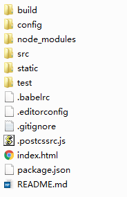

## vue-cli脚手架搭建vue工程

#### 使用模板创建项目
1.安装vue-cli

```
npm install -g vue-cli
```

2.使用模板创建vue的工程

```
vue init <template-name> <project-name>
//示例：使用webpack模板创建工程
vue init webpack myProject
//如果因为网络原因导致，下载不下来webpack的模块，那么可以从git上下载vuejs-template/webpack的zip包，然后解压到本机，执行如下命令：  
//模板路径是template的上一层  
vue init 模板的路径 myProject
```

官方给出了如下几种模板，具体可以参考vue-cli在github上的说明。  

* webpack
* webpack-simple
* browserify
* browserify-simple
* pwa
* simple


#### 基于webpack的vue项目结构说明

1.项目结构  



build目录放置的是wepack的配置文件以及在package.json中配置的npm命令所调用的脚本(build命令、dev命令等)。  
config目录放置的是配置文件，主要包括生产环境和开发环境中的各种webpack配置文件中的配置项。  
node_modules是依赖包的安装目录。  
src是源码目录。  
static用于放置静态资源，包括图片、js文件、css文件等。  
test用于放置测试代码。  

2.常用的npm命令  
1）npm run dev  
开发调试最常用的命令，该命令会"运行"该项目，并主动打开浏览器显示项目的主界面，当有文件修改时，会主动重新编译和刷新浏览器的界面  
2）npm run build  
用于项目的发布，该命令会编译整个项目，并生成dist目录，该目录中放置的是编译后的html文件、编译后的js文件以及依赖的静态文件。
