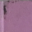

## 开始HTML
HTML(HyperText Markup Language)是一种标记语言，用于告诉浏览器如何构造网页。  

元素的组成：
1.开始标签  
2.介绍标签  
3.内容  
4.元素，由前三者组成  

空元素，元素只有一个标签，通常用来在此元素所在位置插入/嵌入一些东西，例如  

元素可以有属性  

布尔属性，没有值的属性，只有属性名称，例如disabled

HTML的典型结构：  
```
1.<!DOCTYPE html> 声明文档类型
2.<html></html> 根元素
3.<head></head> 头元素
4.<meta charset="utf-8"> 声明字符集
5.<title></title> 页面标题
6.<body></body> 主体
```

空白，html会将连续的多个空白解析为一个空白  

字符的特殊编码：

|字符|编码|
|---|----| 
|`<`|`&lt;`|
|`>`|`&gt;`|
|`"`|`&quot;`|
|`'`|`&apos`|
|`&`|`&amp`|

html的注释：  
```
<!-- 这是注释 -->
```

## Head标签中的子元素
meta，元数据就是描述数据的数据  
```
//字符集
<meta charset="uft-8">
//许多meta元素包含了name和content特性
<meta name="author" content="weieyuan">
<meta name="description" content="software developer">
```  

html中使用css和javascript:  
```
<link rel="stylesheet" href="./demo.css">
<script src="./demo.js"></script>
```

为文档设置主语言：  
设置语言后，可以被搜索引擎更有效地搜索    
```
<html lang="en-US">
```

## Html的文字处理基础
标题元素：  
尽量不要让层次超过3层。  
```
<h1>
<h2>
<h3>
<h4>
<h5>
<h6>
``` 

## 创建超链接
使用图片链接：  
```
<a href="url">
  
</a>
```

链接为下载链接时，指定下载名称：    
```
<a href="download_url" download="xxx.png">下载图片</a>
```

电子邮件链接：    
```
//使用mailto:link的格式
<a href="mailto:weieyuan@yeah.net">发送邮件</a>
```
 
## 高级文本排版
描述列表： 
```
dl(description list)，dt(description term)，dd(description description)
```
<dl>
<dt>term 1</dt>
<dd>这个是term-1的描述信息</dd>
<dt>term 2</dt>
<dd>这个是term-2的描述信息</dd>
</dl>

引用：  
块级应用使用`<blockquote>`，行内引用使用`<q>`

缩略语：  
```
<p>we use <abbr title="Hypertext Markup Language">HTML</abbr></p>
```

上标和下标：  
sup：上标；sub：下标  
<p>25<sup>th</sup></p>
<p>C<sub>8</sub></p>

展示计算机代码：
```  
1.<code>  
2.<pre>  
3.<var>  
4.<kbd>  
5.<samp>
```  

标记时间和日期：  
```
<time datetime="2016-01-20">20 January 2016</time>
```

## 文档和网站的结构
理解主要元素的定义：  
```
1.<main> 每个页面中使用一次    
2.<article>  闭合一块与自身相关的内容
3.<section>  单独功能构成的页面
4.<aside>  额外的信息
5.<header>  介绍性的内容
6.<nav>  导航
7.<footer>  页脚
```

没有语义的装饰元素：  
```
<div> 块级
<span> 行内
```

换行和水平分割：  
```
<br>
<hr>
```

## 多媒体和插入
视频：  
```
//controls:用户能够控制视频和音频功能
//video标签中的内容是备选内容，当浏览器不支持video时会显示
<video src="xxx.webm" controls>
	<p>这是备选内容</p> 
</video>

//浏览器检测source标签中的视频，会播放第一个相匹配的视频
<video controls>
	<source serv="xxx.mp4" type="video/mp4">
    <source serv="xxx.webm" type="video/webm">
	<p>这是备选内容</p>
</video>
```

音频：  
```
<audio>
	<source serv="xxx.mp3" type="audio/mp3">
    <source serv="xxx.ogg" type="audio/ogg">
	<p>这是备选内容</p>
</audio>
```

显示音轨文件：   
```
<video controls>
	<source serv="xxx.mp4" type="video/mp4">
    <source serv="xxx.webm" type="video/webm">
    <track kind="subtitles" src="xxx.vtt" srclang="en"></track>
	<p>这是备选内容</p>
</video>
```

## 嵌入
iframe的使用：  
```
<iframe src="url" width="100%" height="500" frameborder="0" allowfullscreen sandbox>
  <p>备选内容</p>
</iframe>
allowfullscreen: 可以使用全屏API放置到全屏模式  
frameborder:如果设置为1（默认值），表示在此框架和其他框架之间绘制边框，设置为0，表示删除边框。
sandbox：提高安全性设置
```

使用HTTPS:  
1.减少了内容在传输过程中被篡改的机会  
2.防止嵌入内容访问父文档中的内容

使用sandbox来提高安全性。

配置CSP指令：  
CSP是内容安全策略，它提供一组HTTP标头，用于提高HTML文档的安全性。例如设置X-Frame-Options可以防止网页被嵌入。  

## 表格(Table)
`<clo>``<colgroup>`用于定义列的样式。`<colgroup>`标签位于`<table>`标签下面。  
```
//1
<table>
  <colgroup>
    <col> //样式将应用于第一列
    <col style="background-color: yellow">//样式将应用于第二列
 </colgroup>
</table>

//2
<table>
  <colgroup>
    <col style="background-color: yellow" span="2">//span定义了样式将应用于多少列上
 </colgroup>
</table>
```

`<caption>`用于定义表格的标题，位于`<table>`标签下。  

## Html元素
img、map、area:   
```
//usemap:与元素相关联的map的部分URL(以#开头)
 
//map与area一起定义一个图像映射
//map中的name属性是必须的，且不能为空、不能带空格
<map name="map">
  //area：在图片上定义一个热点区域，可以关联一个超链接，仅在map内部使用
  //coords：描述了区域的坐标，如果为矩形(x1,y1,x2,y2)，表示左上、右下坐标；如果为圆形(x,y,r)，表示圆心坐标和半径
  //shape:形状(矩形、圆形、多边形)
  //target: 表示在什么地方显示链接的资源，_self(在当前区域加载，默认值)、_blank(在新的未命名的窗口)、_parent、_top
  <area shape="rect" coords="0,0,100,100" href="1.html"></area>
  <area shape="rect" coords="100,0,200,100" href="2.html"></area>
</map>
```

## 块级元素与行内元素
区别：
  
* 一般情况下行内元素只能包含数据和其他行内元素，而块级元素可以包含行内元素和其他块级元素。
* 默认情况下，行内元素不会以新行开始，而块级元素会新起一行。
* 块级元素可以设置宽高、行内元素不可以设置宽高
* 块级元素可以设置margin、padding；行内元素水平方向margin-left、margin-right、padding-left、padding-right可以生效，但在垂直方向上margin-top、margin-bottom、padding-top、padding-bottom不能生效。

有些行内元素是可以设置宽高的，原因是：  
有些行内元素是可替换元素，例如`img、input、textarea、select、button、label`，这些元素会根据元素的标签和属性来决定元素的具体内容，替换元素一般是有内在尺寸的，例如width、height。


行内元素：  
```
b,big,i,small,tt
abbr,strong,em
a,br,img,map,script,span,sub,sup
button,input,label,select,textarea
```

块级元素：  
```
div,canvas,p,h1,footer,header,hr,ul,ol
```

## web worker
模拟多线程，可以让javascript在后台运行，而不阻塞当前的运行。

```
//主页面
var worker = new Worker("./calc.js");
worker.postMessage([1,2,3,4,5]);
worker.addEventListener("message", function(event){
  console.log(event.data);
});
worker.addEventListener("error", function(event){
  console.log(event.message);
});

//calc.js
this.onmessage = function(event){
  return sum(event.data);
}

function sum(arr){
  return arr.reduce(function(clc, cur){
    return clc + cur;
  });
}
```

## postMessage
在不同的文档中进行通信，比如当页面嵌入其它页面时，可以在这两个页面之间进行通信。  

```
//父页面
window.addEventListener("message", function(event){
  console.log(event.origin);
  console.log(event.data);
});
//第一个参数表示发送的消息内容，第二个参数表示发送的目标url
window.frames[0].postMessage("I am parent", "http://localhost:3000")

//子页面
window.addEventListener("message", function(event){
  console.log(event.origin);
  console.log(event.data);
  console.log(event.source);//event.source表示对发送消息的窗口对象的引用
});
window.parent.postMessage("I am child", "http://localhost:63342");
```

## cors
CORS(cross-origin-resource-sharing)跨域资源共享。

XMLHttpRequest level2中支持跨域请求。

检测浏览器是否支持跨域XMLHttpRequest：  
```
var xhr = new XMLHttpRequest();
if(xhr.withCredentials != undefined){
  console.log("支持跨域请求");
}
```

需要后台配置设置`Access-Control-Allow-Origin`