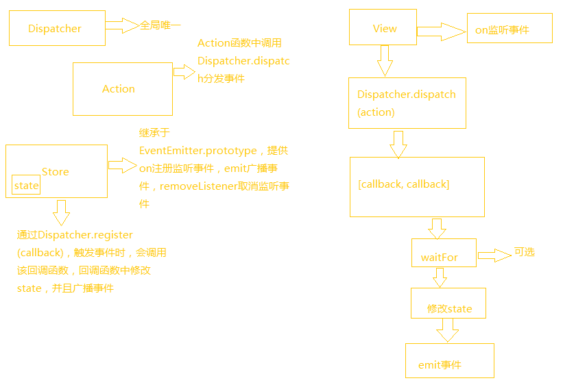
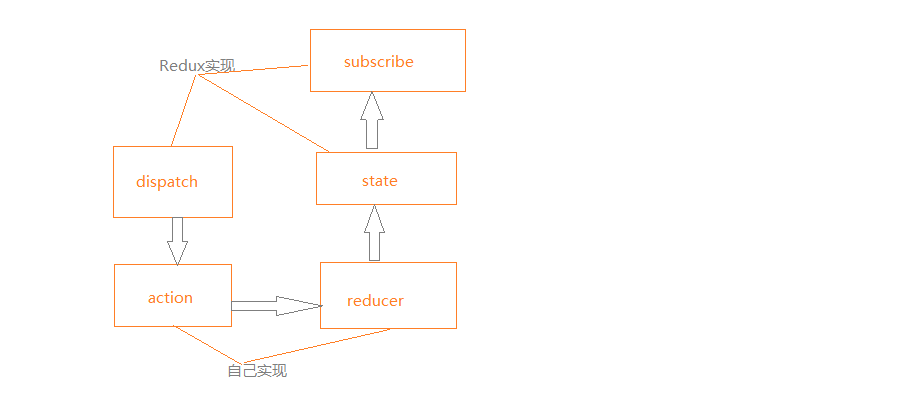

## React新的前端思维方式
create-react-app脚手架使用：    
```
npm install create-react-app -g

create-react-app prj
```

在使用JSX的范围内必须要有React。  

React判断一个元素是Html元素还是React组件的原则就是看第一个字母是否是大写。  

JSX中使用了事件委托，所有事件都被事件处理函数捕获，然后根据具体的组件分配给特定的函数。  

React渲染组件时，会对比这一次产生的Virtual DOM和上一次渲染的Virtual DOM，只更新差异部分。

## 设计高质量的React组件
props或者state的变化都可能引起组件的重新渲染。  

style属性值有两层花括号，外层表示是JSX的语法，内层表示这是一个对象常量：  
```
<Button style={{color: "red"}}/>
```

React要求render函数只能返回一个元素。  

propTypes检查，建议在开发环境中使用，在生产环境不要使用：    
```
Counter.propTypes = {
  caption: PropTypes.string
};
```

设置默认值：  
```
Counter.defaultProps = {
  caption: ""
};
```

render函数返回null或者false，表示这个组件不需要渲染任何DOM元素。  

componentDidMount被调用的时候，render函数返回的东西已经引发了渲染，组件已经被装载到了DOM树上。

componentWillMount可以在服务器端调用，也可以在浏览器端调用，componentDidMount只能在浏览器端调用。

只要父组件的render函数被调用，在render函数中被渲染的子组件就会经历更新过程，不管父组件传递给子组件的props有没有变化，都会触发子组件的componentWillReceiveProps函数。

调用forceUpdate会强制引发一次重新绘制。

应该考虑实现shouldComponentUpdate(nextProps, nextState)，返回false表示组件不需要重新渲染，返回true表示组件需要重新渲染，可以提升性能。

## 从Flux到Redux
**Flux的思想：**  



Flux的缺点：  

* Store之间的依赖关系，当多个Store之间有依赖关系时，需要通过Dispatcher.waitFor函数来确定调用关系。
* 难以进行服务器端渲染
* Store混杂了逻辑和状态

**Redux思想：**  
  


dispatch接收action参数，调用reducer生成新的state，在state变化后通知订阅者。  
reducer接收state和action参数，生成新的state。  
action描述了动作类型和传递的数据。  

createStore的简易实现：  
```
const createStore = (reducer) => {
	let state = {};
    let listeners = [];

    const getState = () => state;
    const dispatch = (action) => {
        let prevState = state;
		state = reducer(prevState, action);
        listeners.forEach((listener) => listener(state));
        return state;
    };

    const subscribe = (listener) => {
      listener.push(listener);
      return () => {
        listeners = listeners.filter((l) => l!= listener)
      }
    };

    return {
      getState,
      dispatch,
      subscribe
    };
};
```

三条规则：  

* 应用的state存储在全局唯一的state中
* state是只读的，只能通过emit一个action来修改state
* 使用纯函数来实现reducer，reducer中不要修改旧的state，返回一个新的state

使用示例：  
```
//actions,js
const SET_CARD_ID = "setCardId"

function setCardId(cardId) {
    return {
        type: SET_CARD_ID,
        cardId: cardId
    };
}

export {SET_CARD_ID, setCardId}

//reducer.js
import * as actions from "./actions"
import {combineReducers} from "redux"

function RemarkDetails(state = {}, action) {
    switch (action.type) {
        case actions.SET_CARD_ID : {
            return {...state, cardId: action.cardId}
        }
        default: {
            return state;
        }
    }
}

const reducer = combineReducers({
    RemarkDetails
})

export default reducer

//store.js
import {createStore} from "redux"
import reducer from "./reducer"

const store = createStore(reducer)

export default store
```

容器组件和傻瓜组件：  
容器组件负责和Redux Store打交道，傻瓜组件不感知Redux Store，负责逻辑处理和ui展示。容器组件通过props向傻瓜组件传递数据，达到傻瓜组件和Redux Store打交道的目的。  

react-redux的作用：  
1.通过connect返回容器组件，容器组件会自动订阅Redux state，通过dispatch发布action。  
2.通过Provider组件提供context功能，用于向子组件传递Store对象。   

使用： 
```
//connect返回的组件必须用Provider包裹，否则connect中访问不到store对象
connect([mapStateToProps], [mapDispatchToProps], [mergeProps], [options])
  mapStateToProps(state, [ownProps])用于将state映射为props
  mapDispatchToProps(dispatch, [ownProps])props中添加callback，callback中可以调用dispatch;如果mapDispatchToProps是一个对象，那么对象中的函数都被认为是actionCreator，并且会自动调用dispatch。例如如下两种方式等价的：
  const mapDispatchToProps = {
    onToggleTodo: toggleTodo
  }
  const mapDispatchToProps = function(dispatch){
    return {
      onToggleTodo: (id) => {
        dispatch(toggleTodo(id));
      }
    }
  }
  
  mergeProps(stateProps, dispatchProps, ownProps)缺省的时候等价于Object.assign({}, ownProps, stateProps, dispatchProps)

<Provider store={store}>
	<MyRootComponent />
</Provider>
```


